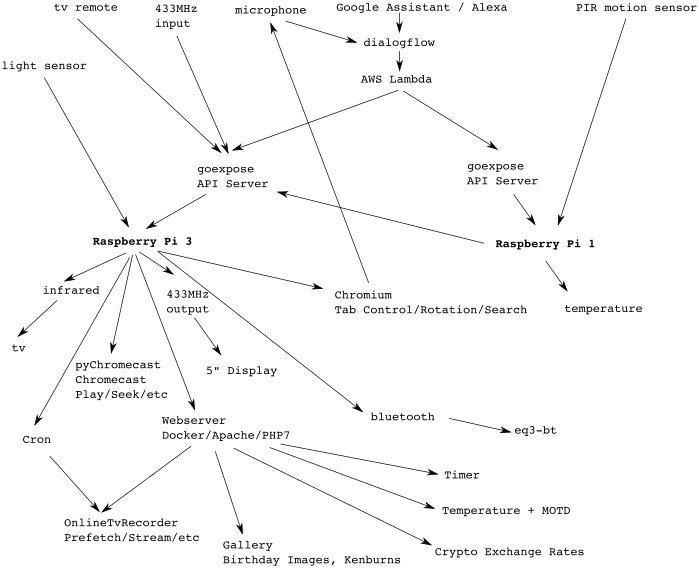

# Smart Home + IoT
Collection of scripts which I use at home. 

I use these helpers to
 - control TV via Infrared
 - control lights via 433MHz transmitter
 - control lights via TV remote (via 433MHz transmitter)
 - control lights when motion is detected (via 433MHz transmitter)
 - take pictures via webcam

Technically I use
 - Google Home for always listening
 - API.AI for voice and text-based conversations
 - AWS Lambda which receives the API.AI webhooks
 - Router Port Forwarding and DynDNS
 - [Goexpose](https://github.com/phonkee/goexpose) as api server that maps url to shell commands
 - Raspberry PI 3
 - Aukru 433 MHz transmitter / sender / receiver
 - LAOMAO 5 Infrared LED emission & receiver
 - DHT22/AM2302 temperature monitoring (but no more 3.3V)
 - 3.5" touch display running browser to show temperature and have command shortcuts
 - System update to Strech incl. Desktop and autostart browser with tabswitcher plugin



Potential future projects
 - Better documentation ;)

## Goexpose
First install golang on your Raspberry Pi: https://pradippatil.github.io/post/golang-on-rpi/

Then install Goexpose
```bash
go get github.com/phonkee/goexpose 
```

Create log directories
```bash
sudo mkdir /var/log/goexpose
sudo chown pi /var/log/goexpose/
```

Finally run it
```bash
go run ./go/src/github.com/phonkee/goexpose/cmd/goexpose/goexpose.go --config assistant-helper/config.yaml -format yaml -log_dir /var/log/goexpose -alsologtostderr=true -stderrthreshold=INFO -v 2
```

